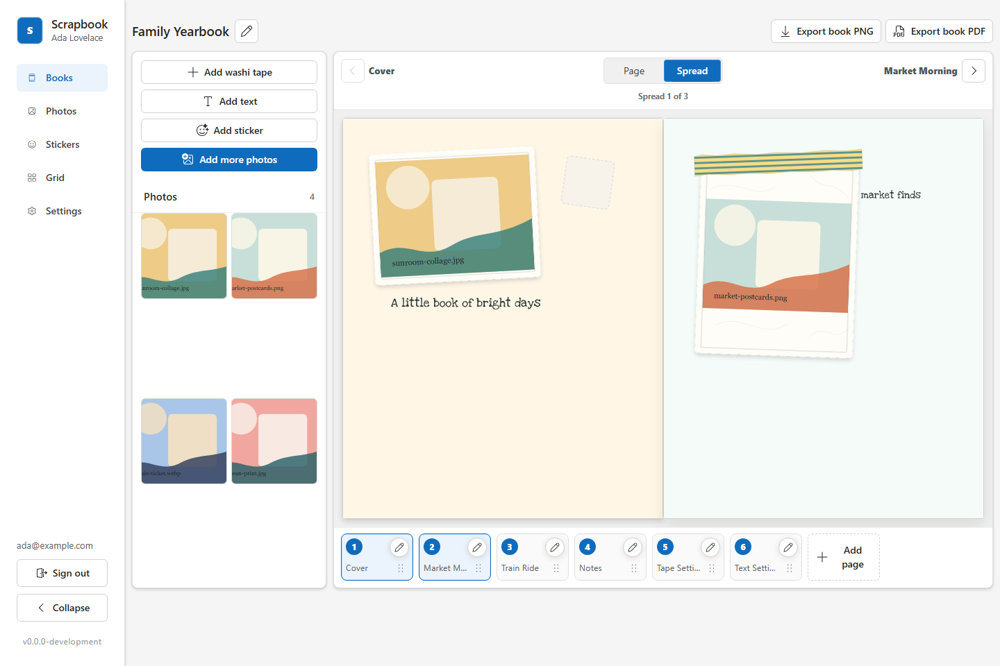
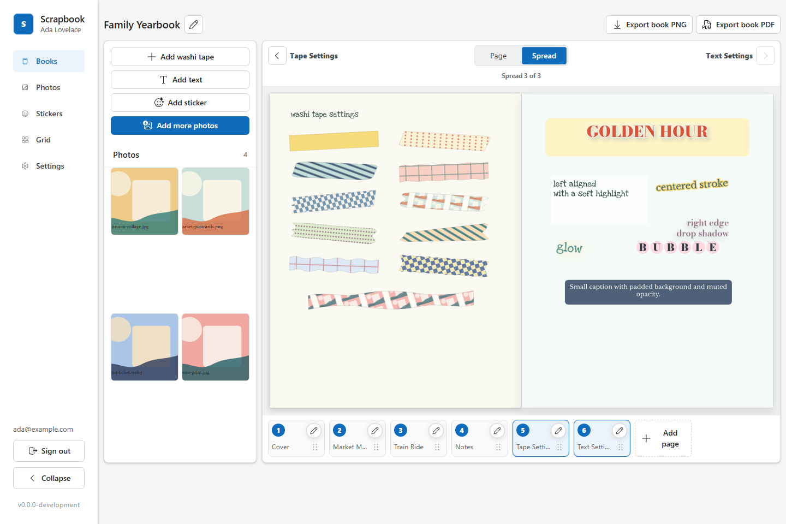
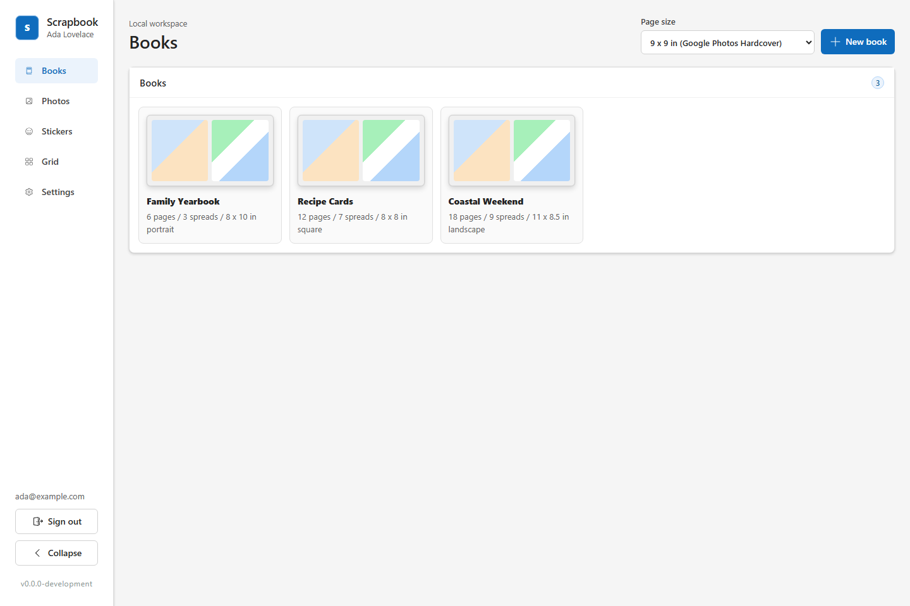
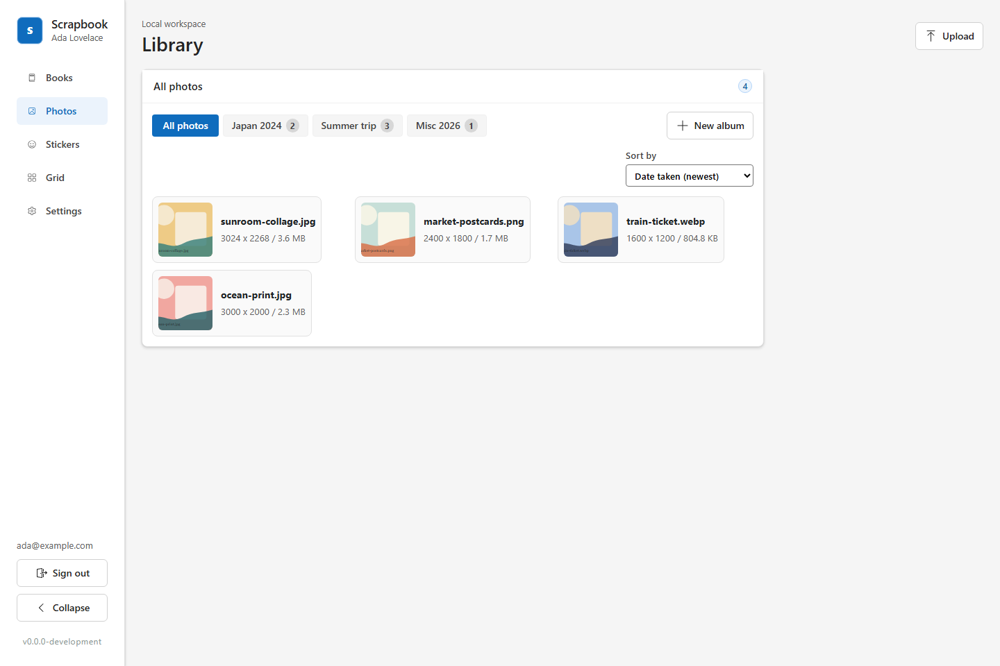
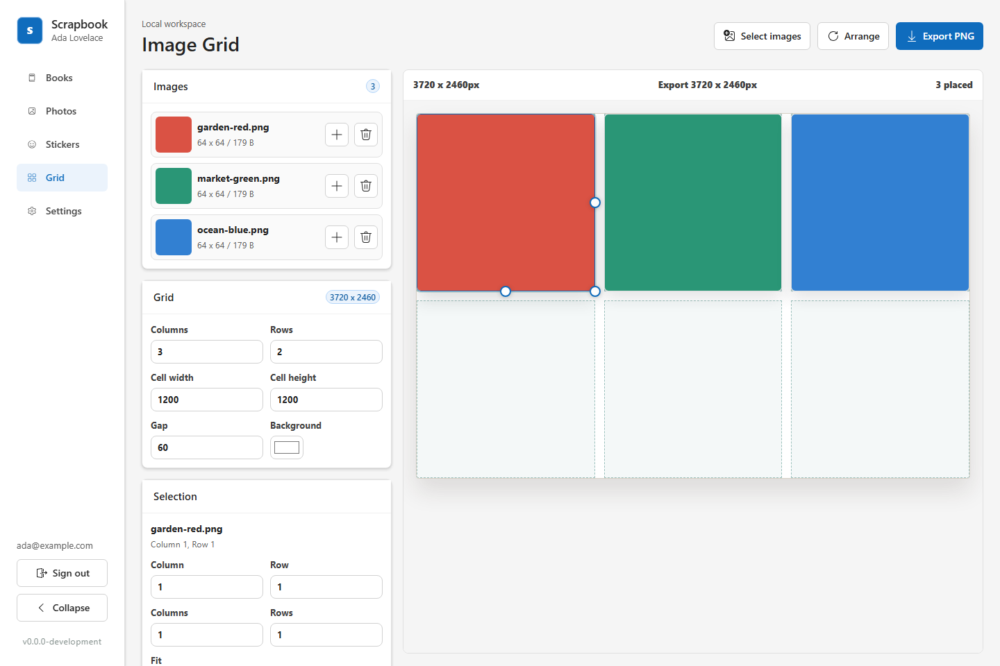

# Zakka

Zakka (Japanese: 雑貨 "miscellaneous goods") is a self-hosted digital scrapbooking web app for creating photo books and scrapbook pages from your own images. It gives you a browser-based workspace for uploading photos, arranging pages, editing books, and exporting finished work while keeping the application data in storage you control.

The production build is packaged as a single Docker image. The container runs the API, serves the built web app, applies SQLite migrations on startup, and stores durable data in a mounted data directory.

## Features

- Account registration and login with browser sessions.
- Local photo library with uploads and generated variants.
- Book workflows with ordered pages and facing spread editing.
- Page editor tools for photos, text, stickers, washi tape, page settings, and layout adjustments.
- Image grid workspace for arranging uploaded photos.
- Page and book export support.
- Local-first persistence using SQLite plus managed files for uploads, page documents, previews, variants, and exports.
- OpenAPI-backed API under `/api/v1`.

## Screenshots

| | |
| --- | --- |
|  |  |
| Book editor with a facing-page spread | Text effects and washi tape variations |
|  |  |
| Books index | Photo library with albums |
|  | |
| Image grid workspace | |

Refresh these with `pnpm screenshots:product`; the script lives at [scripts/screenshots/capture-product-screenshots.ts](scripts/screenshots/capture-product-screenshots.ts) and writes PNGs into [docs/product-screenshots/](docs/product-screenshots/).

## Quick Start With Docker Compose

From the repository root:

```sh
docker compose up --build
```

Open the app at:

```text
http://localhost:4000
```

Docker Compose stores application data in the `zakka-data` Docker volume and mounts it at `/data/zakka` inside the container.

## Run The Docker Image

Pull and run the published image:

```sh
docker pull ghcr.io/jakeshirley/zakka:latest
docker volume create zakka-data
docker run --detach \
  --name zakka \
  --publish 4000:4000 \
  --env NODE_ENV=production \
  --env API_HOST=0.0.0.0 \
  --env API_PORT=4000 \
  --env WEB_ORIGIN=http://localhost:4000 \
  --volume zakka-data:/data/zakka \
  ghcr.io/jakeshirley/zakka:latest
```

Then visit `http://localhost:4000`.

Check container health with:

```sh
curl --fail http://localhost:4000/api/v1/health
```

## Configuration

Zakka is configured with environment variables.

| Variable | Default | Notes |
| --- | --- | --- |
| `NODE_ENV` | `development` | Use `production` in the Docker image. |
| `API_HOST` | `127.0.0.1` | Use `0.0.0.0` in containers. |
| `API_PORT` | `4000` | Port the API and web app listen on. |
| `WEB_ORIGIN` | `http://localhost:5173` | Public browser origin for the deployed app. For Docker on localhost, use `http://localhost:4000`; for LAN access, use the exact local HTTP origin users open in their browser. |
| `SESSION_COOKIE_SECURE` | Auto-detected per request | Whether browser session cookies require HTTPS. By default, HTTPS requests and requests with `X-Forwarded-Proto: https` receive `Secure` cookies; local HTTP requests do not. |

For a public deployment, set `WEB_ORIGIN` to the HTTPS origin users will open in their browser, such as `https://zakka.example.com`.

If the app is served by both a local HTTP URL and a remote HTTPS reverse proxy, leave `SESSION_COOKIE_SECURE` unset and configure the proxy to pass `X-Forwarded-Proto`. Browsers keep separate host-only session cookies for the local IP and remote domain.

## Data And Backups

The data directory contains the SQLite database and all managed files. In Docker this is `/data/zakka`.

```text
/data/zakka/
  scrapbook.sqlite
  scrapbook.sqlite-shm
  scrapbook.sqlite-wal
  documents/
  uploads/
  variants/
  previews/
  exports/
```

Back up the entire data directory, not only the SQLite file. For Docker, back up the volume mounted at `/data/zakka`. Stop the container before filesystem backups so SQLite and stored files are captured together.

To upgrade, pull the new image, stop the old container, and start the new one with the same data volume. Migrations run automatically on startup.

## Local Development

Requirements:

- Node.js 24 or newer
- Corepack enabled so the pinned pnpm version is used

Install dependencies:

```sh
corepack enable pnpm
pnpm install
```

Run the full development stack:

```sh
pnpm dev
```

Or run each side separately:

```sh
pnpm dev:api
pnpm dev:web
```

In development, the API runs at `http://127.0.0.1:4000` and the Vite web app runs at `http://127.0.0.1:5173`.

Useful checks:

```sh
pnpm format:check
pnpm lint
pnpm typecheck
pnpm test
pnpm build
```

Apply database migrations without starting the API:

```sh
pnpm --filter @zakka/api db:migrate
```

## Project Layout

```text
apps/api                 Hono API, persistence, storage, migrations, exports
apps/web                 React and Vite web client
packages/api-contract    Shared API schemas and contract types
packages/config          Runtime configuration parsing
packages/domain          Domain types and pure helpers
packages/editor-core     Editor models, fonts, and sticker data
docs                     Architecture, deployment, configuration, and data notes
```

## More Documentation

- [Configuration](docs/configuration.md)
- [Deployment](docs/deployment.md)
- [Development Workflow](docs/development.md)
- [Local Data](docs/local-data.md)